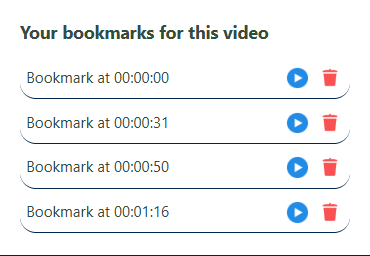

<h1 align="center">YouTube Bookmarker Extension 🎥🔖</h1>
📝 Description:
Welcome to YouTube Bookmarker, a powerful and user-friendly Chrome Extension that allows you to save timestamps while watching YouTube videos. With this tool, you can:

Bookmark your favorite video moments.
Easily navigate to saved timestamps with a single click.
Delete bookmarks when no longer needed.
This project simplifies video note-taking, enhancing your YouTube viewing and learning experience.

 
🛠️ Tools and Technologies Used:

   

📃 Features:
<ul> <li><strong>Save Timestamps:</strong> Bookmark specific video moments directly while watching YouTube.</li> <li><strong>Quick Navigation:</strong> Jump back to saved timestamps instantly.</li> <li><strong>Delete Bookmarks:</strong> Remove unwanted bookmarks from the list.</li> <li><strong>Persistent Storage:</strong> Bookmarks are stored and synced via Chrome storage.</li> <li><strong>Dynamic Bookmark Controls:</strong> Play or delete bookmarks with intuitive UI controls.</li> <li><strong>Seamless Integration:</strong> The extension integrates directly into YouTube's video player.</li> </ul>
🚀 How It Works:
Install the Extension
Load the extension via Chrome Developer Mode with the manifest.json file.

Bookmark Your Video Moments

Open any YouTube video.
Click the "Bookmark" button added to the YouTube player controls.
Manage Your Bookmarks

View all saved timestamps in the popup.
Play or delete bookmarks directly from the popup interface.
Navigate Effortlessly

Click a bookmark to jump to the exact timestamp in the video.

🌟 Screenshots:
YouTube Bookmark Button

Popup UI for Managing Bookmarks

<a href="#top">Back to Top</a>
